# 1 Установока wls и настройка Docker

### Установка wls
```bash
wsl --install -d Ubuntu
```
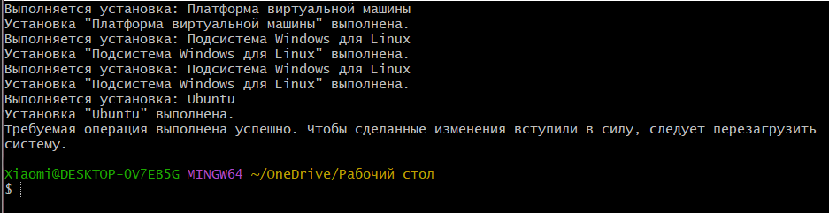

### Первый запуск Ubuntu

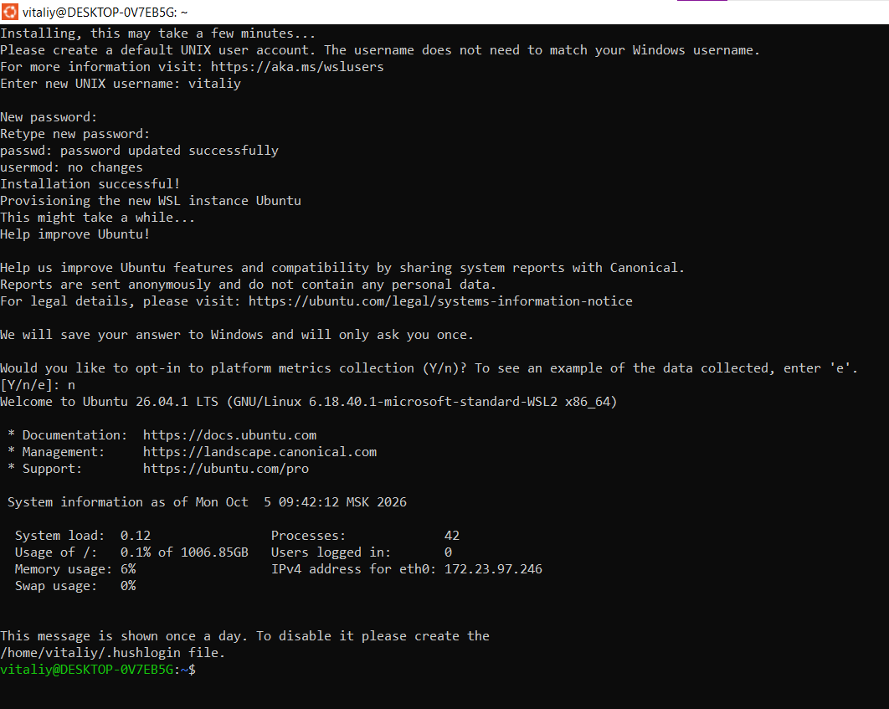

### Настройка Docker Desktop
1. Settings  
2. Resources 
3. WSL Integration 
4. Ubuntu, 
5. Apply restart.
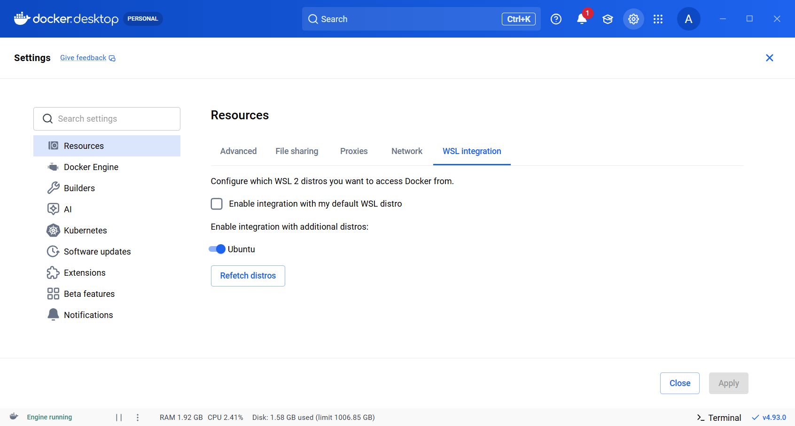

### Проверка 
```bash
wsl.exe -l -v
docker pull hello-world
docker pull nginx:stable-alpine
docker version
docker run --rm hello-world
```
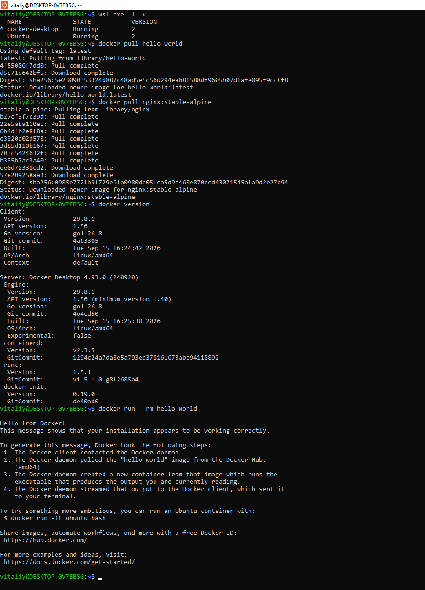
Ubuntu работает на WSL версии 2, оба образа скачаны. У Docker есть разделы Client и Server + выведено Hello from Docker!

# 2 Запуск готового сайта

```bash
docker run -d --name lab-web -p 127.0.0.1:8080:80 nginx:stable-alpine
docker ps
```
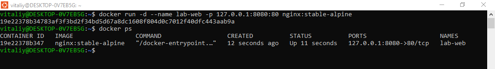
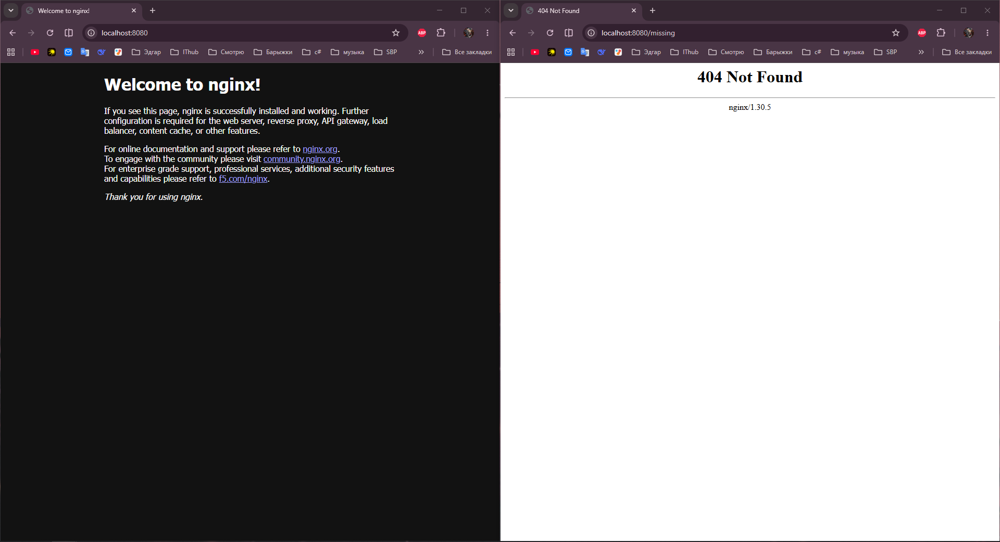
```bash
docker logs --tail 20 lab-web
```
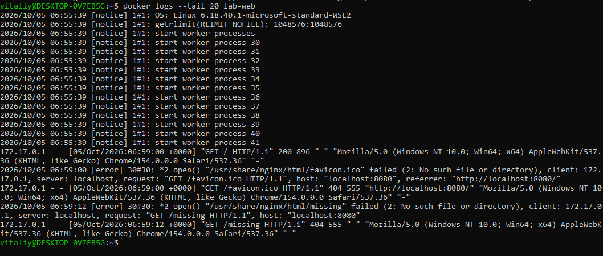

# 3 Остановите и снова запустите сайт

Остановка
```bash
docker stop lab-web
docker ps
docker ps -a
```
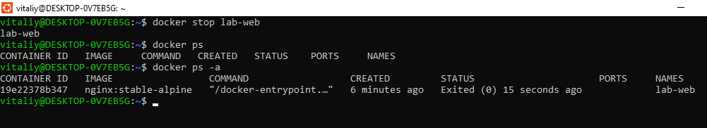

Запуск
```bash
docker start lab-web
docker ps
docker exec lab-web cat /usr/share/nginx/html/index.html
```
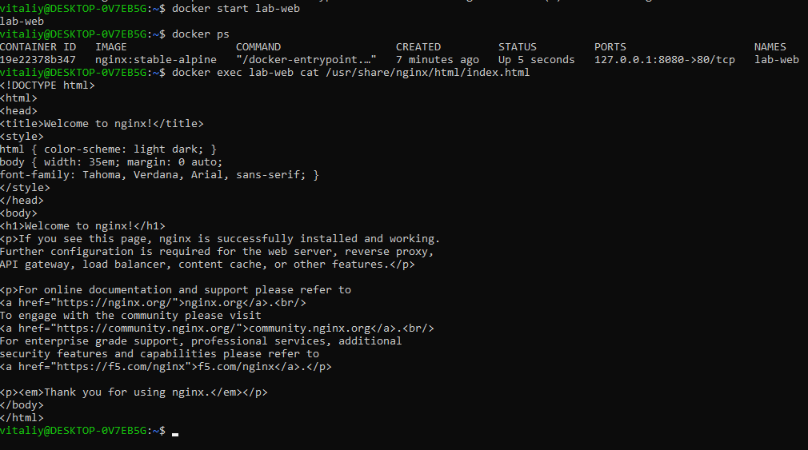

# Этап 4. Файлы сайта

```bash
mkdir -p ~/docker-lesson-01
cd ~/docker-lesson-01
nano index.html
```
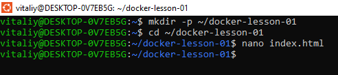
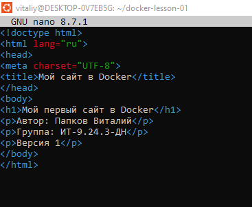

```bash
cd ~/docker-lesson-01
ls -l
nano Dockerfile
```
```bash
FROM nginx:stable-alpine
COPY index.html /usr/share/nginx/html/index.html
```
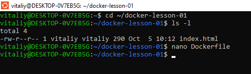
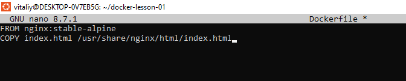
```bash
ls -l
cat Dockerfile
cat index.html
```
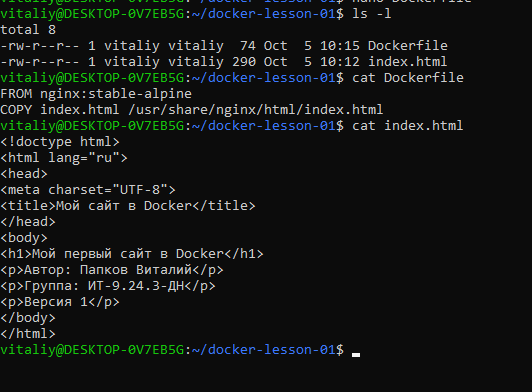

# Этап 5. Сборка образа и запуск
```bash
docker build -t student-site:v1 .
docker image ls student-site
```
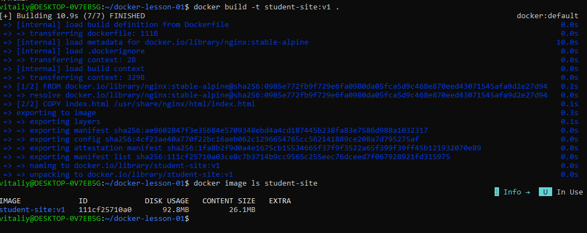

```bash
docker run -d --name my-site -p 127.0.0.1:8081:80 student-site:v1
docker ps
```
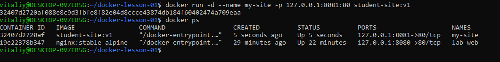
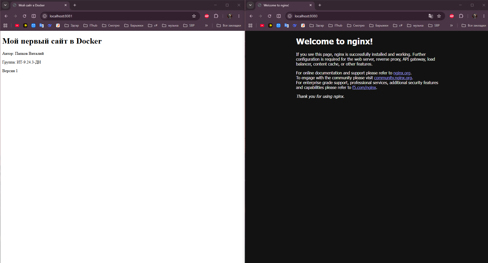
# Этап 6. Вторая версия

```bash
nano index.html
```
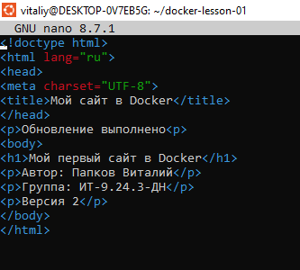

```bash
docker restart my-site
```
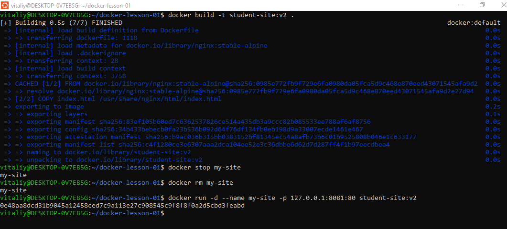
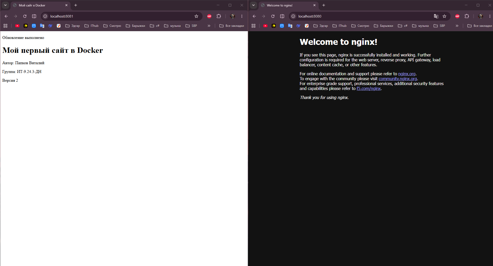

# Этап 7. Второй контейнер

```bash
docker run -d --name my-copy -p 127.0.0.1:8082:80 student-site:v2
docker ps
```
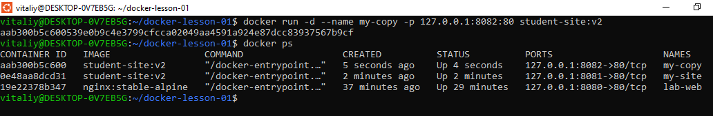
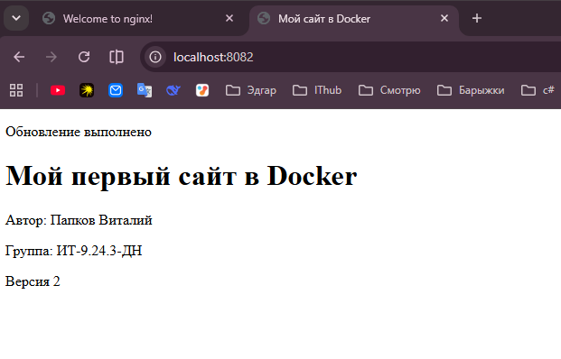

```bash
docker stop my-site
docker ps -a
```
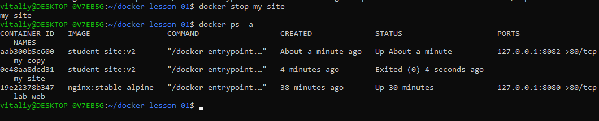
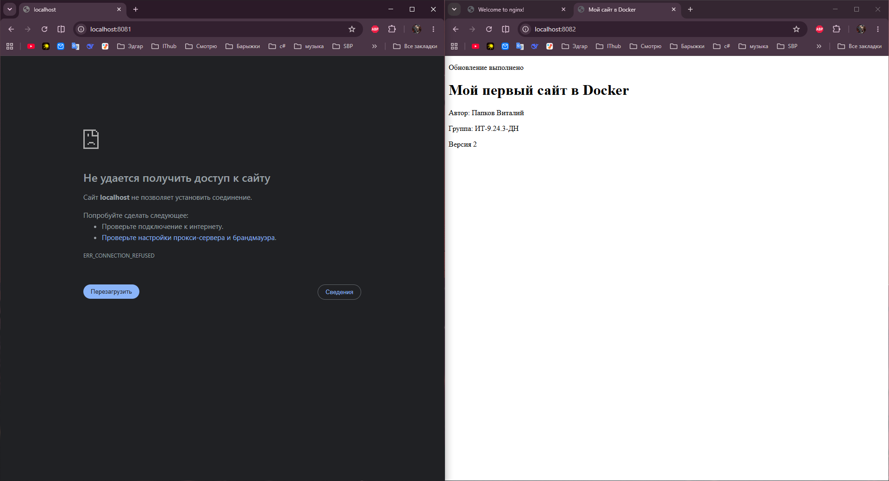

```bash
docker stop my-site
docker ps -a
```
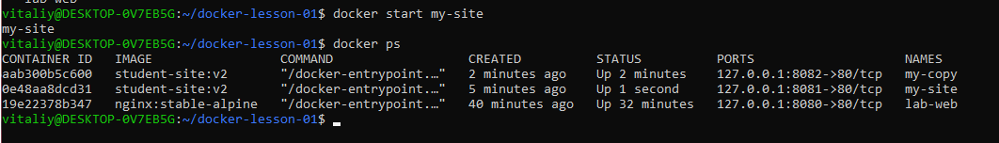

```bash
docker start my-site
docker ps
```
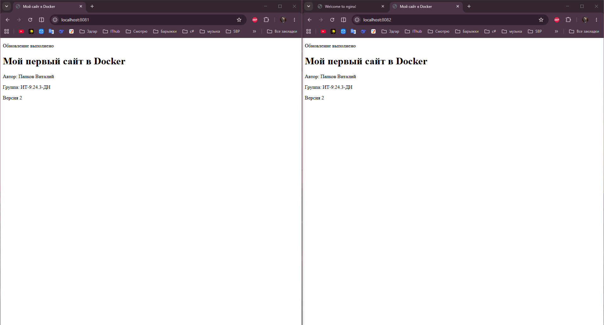

# Этап 8. result.txt

```bash
cd ~/docker-lesson-01
nano result.txt
```
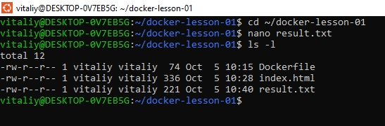
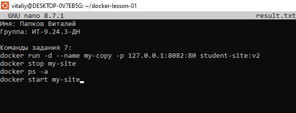

# Завершение работы 
```bash
docker stop lab-web my-site my-copy
docker rm lab-web my-site my-copy
```
