# Этап 1 подготовка
```bash
cd ~/docker-lesson-02
docker pull wordpress:apache
docker pull mariadb:11.4
docker version
docker compose version
```
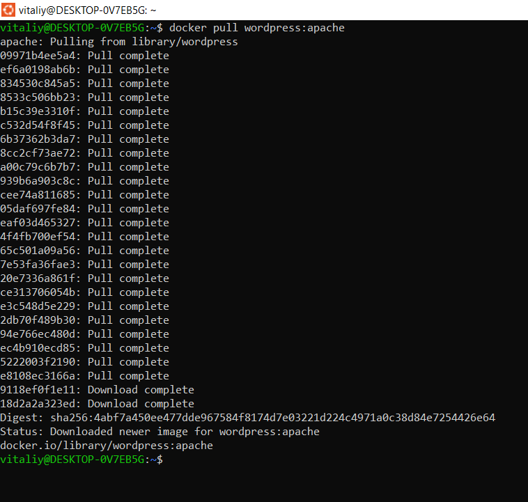
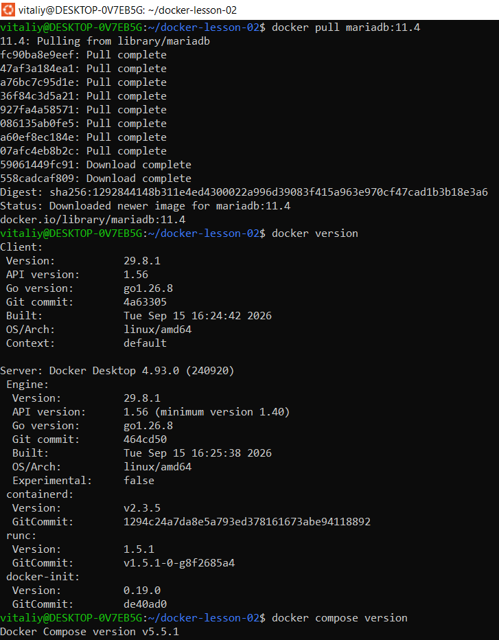

# Этап 2 файл Compose
```bash
nano compose.yaml
```
```bash
name: docker-lesson-02

services:
  db:
    image: mariadb:11.4
    environment:
      MARIADB_DATABASE: wordpress
      MARIADB_USER: student
      MARIADB_PASSWORD: lab-db-pass
      MARIADB_ROOT_PASSWORD: lab-root-pass
    volumes:
      - db_data:/var/lib/mysql
    healthcheck:
      test: ["CMD", "healthcheck.sh", "--connect", "--innodb_initialized"]
      interval: 5s
      timeout: 5s
      retries: 30
      start_period: 30s

  wordpress:
    image: wordpress:apache
    ports:
      - "127.0.0.1:8090:80"
    environment:
      WORDPRESS_DB_HOST: db:3306
      WORDPRESS_DB_NAME: wordpress
      WORDPRESS_DB_USER: student
      WORDPRESS_DB_PASSWORD: lab-db-pass
    depends_on:
      db:
        condition: service_healthy
    volumes:
      - wp_data:/var/www/html

volumes:
  db_data:
  wp_data:
```
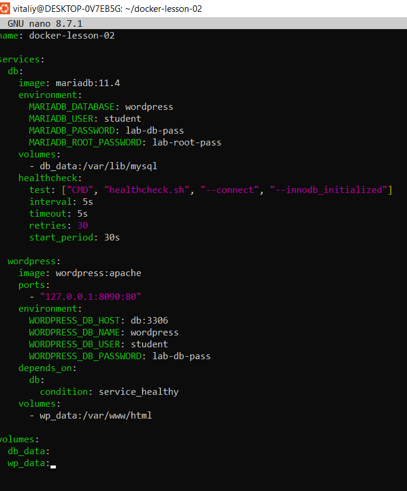
```bash
docker compose up -d
docker compose ps
```
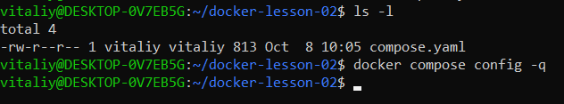
```bash
```

# Этап 3 запуск сервисов
```bash
docker compose up -d
docker compose ps
```
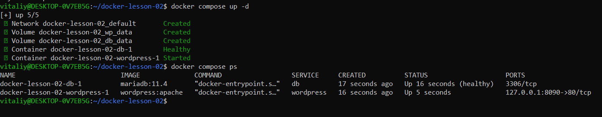

# Этап 4 установка
WordPress установлен. Дальше:
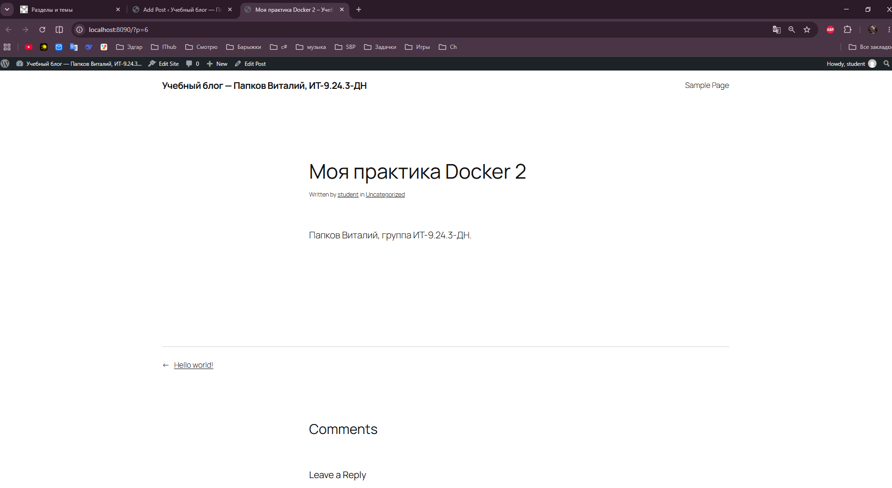

# Этап 5 логи и остановка wordpress
```bash
docker compose stop wordpress
docker compose ps -a
```
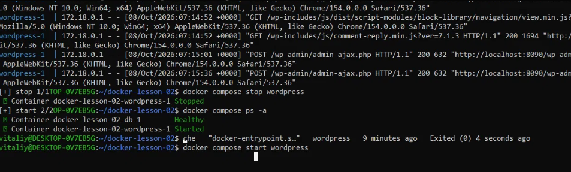
```bash
docker compose start wordpress
docker compose ps
```
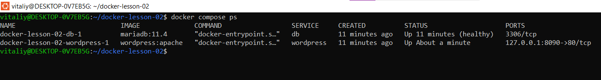

# Этап 6 пересоздание контейнера
```bash
docker compose ps -q > containers-before.txt
docker compose down
docker compose ps -a
docker volume ls --filter label=com.docker.compose.project=docker-lesson-02
```
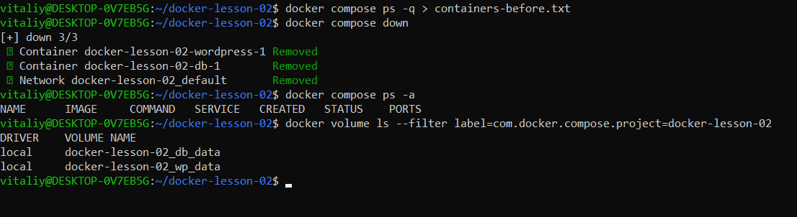

```bash
docker compose up -d
docker compose ps
docker compose ps -q > containers-after.txt
cat containers-before.txt
cat containers-after.txt
```
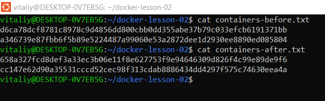

# Этап 7 остановка и восстановление базы
```bash
docker compose stop db
docker compose ps -a
```
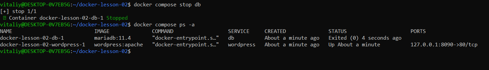
```bash
docker compose start db
docker compose ps
```
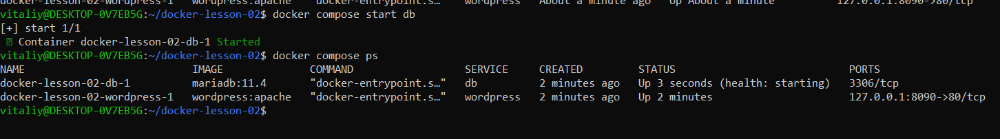
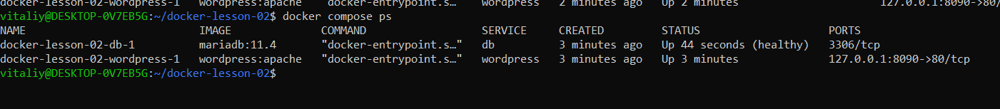
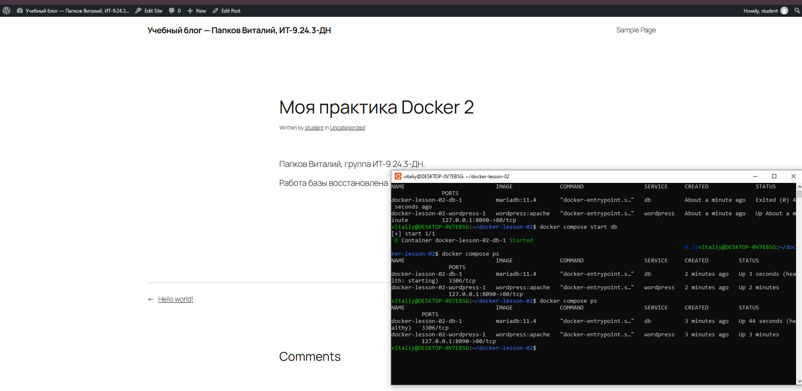

# Этап 8 result.txt
```bash
cd ~/docker-lesson-02
nano result.txt
```
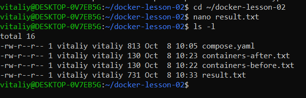