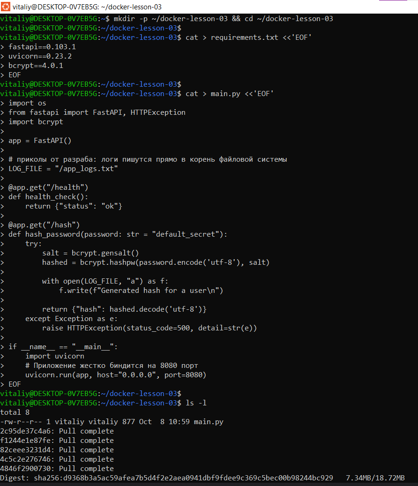
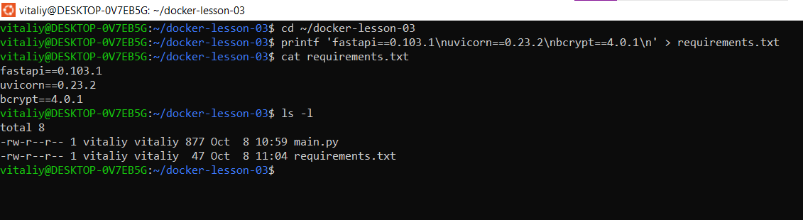
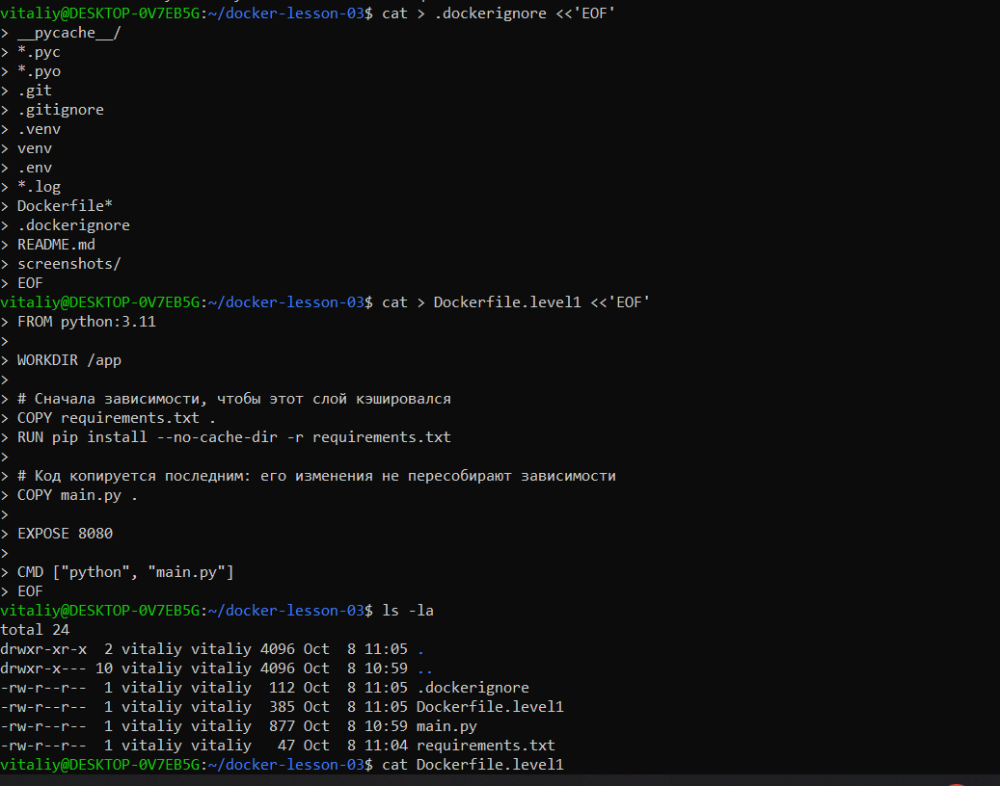
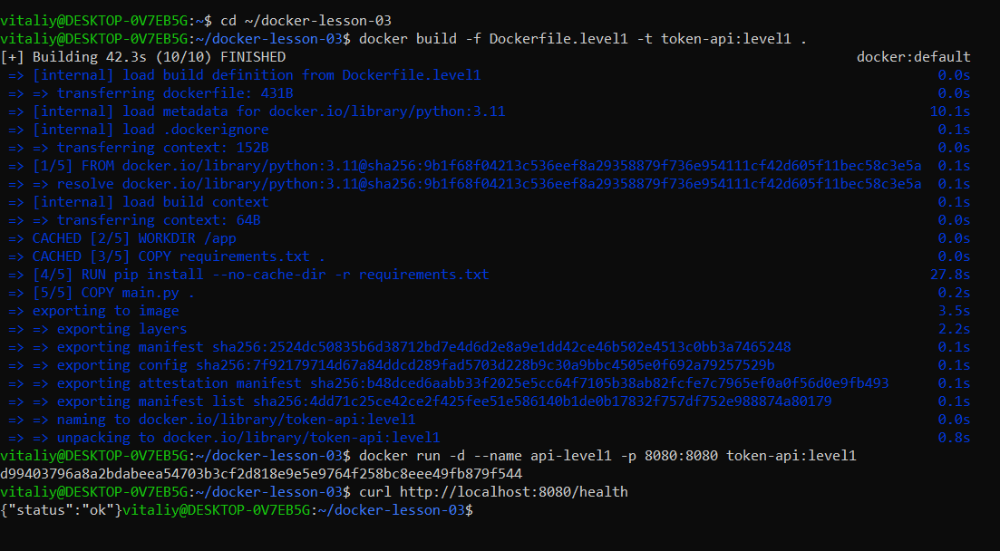
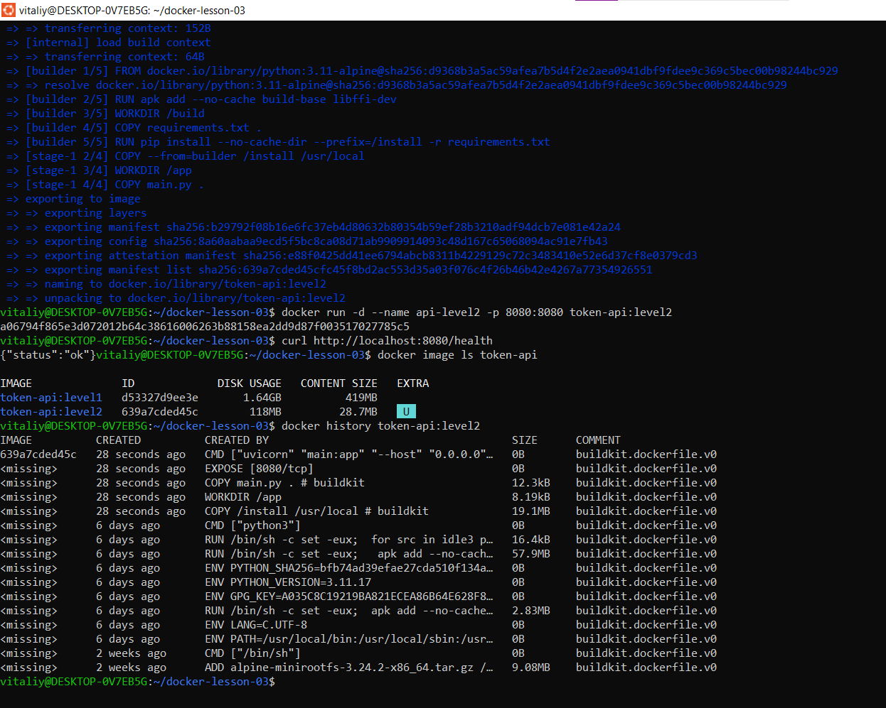
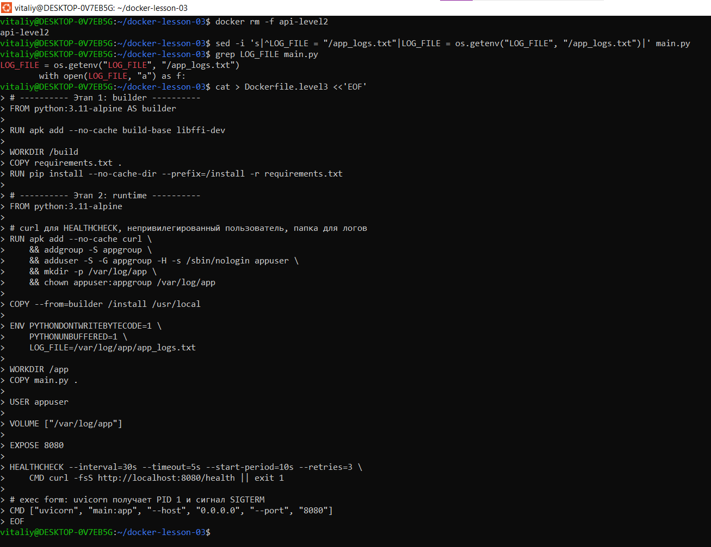
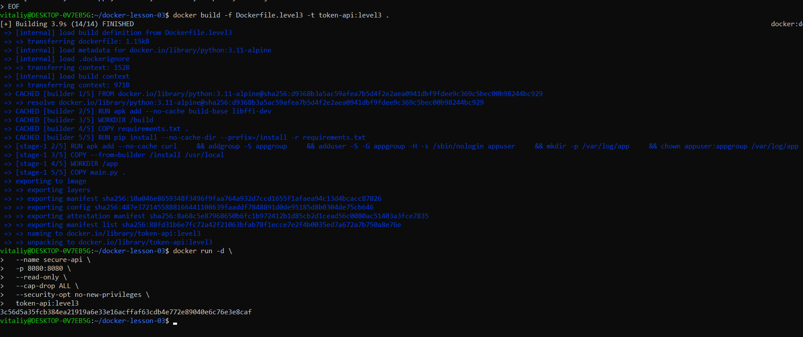
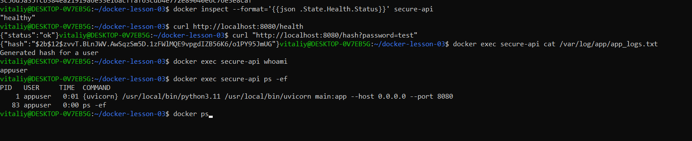

# Уровень 1
```bash
mkdir -p ~/docker-lesson-03 && cd ~/docker-lesson-03

cat > requirements.txt <<'EOF'
fastapi==0.103.1
uvicorn==0.23.2
bcrypt==4.0.1
EOF

cat > main.py <<'EOF'
import os
from fastapi import FastAPI, HTTPException
import bcrypt

app = FastAPI()

# приколы от разраба: логи пишутся прямо в корень файловой системы
LOG_FILE = "/app_logs.txt"

@app.get("/health")
def health_check():
    return {"status": "ok"}

@app.get("/hash")
def hash_password(password: str = "default_secret"):
    try:
        salt = bcrypt.gensalt()
        hashed = bcrypt.hashpw(password.encode('utf-8'), salt)

        with open(LOG_FILE, "a") as f:
            f.write(f"Generated hash for a user\n")

        return {"hash": hashed.decode('utf-8')}
    except Exception as e:
        raise HTTPException(status_code=500, detail=str(e))

if __name__ == "__main__":
    import uvicorn
    # Приложение жестко биндится на 8080 порт
    uvicorn.run(app, host="0.0.0.0", port=8080)
EOF
ls -l
```

```bash
docker pull python:3.11
docker pull python:3.11-alpine
```


```bash
cat > .dockerignore <<'EOF'
__pycache__/
*.pyc
*.pyo
.git
.gitignore
.venv
venv
.env
*.log
Dockerfile*
.dockerignore
README.md
screenshots/
EOF
```

```bash
cat > Dockerfile.level1 <<'EOF'
FROM python:3.11

WORKDIR /app

# Сначала зависимости, чтобы этот слой кэшировался
COPY requirements.txt .
RUN pip install --no-cache-dir -r requirements.txt

# Код копируется последним: его изменения не пересобирают зависимости
COPY main.py .

EXPOSE 8080

CMD ["python", "main.py"]
EOF
```


```bash
ls -la
cat Dockerfile.level1
```


```bash
cd ~/docker-lesson-03
docker build -f Dockerfile.level1 -t token-api:level1 .
docker run -d --name api-level1 -p 8080:8080 token-api:level1
curl http://localhost:8080/health
```


# Уровень 2 multi-stage
```bash
docker rm -f api-level1
```
```bash
cat > Dockerfile.level2 <<'EOF'
# ---------- Этап 1: builder (компиляторы есть только здесь) ----------
FROM python:3.11-alpine AS builder

RUN apk add --no-cache build-base libffi-dev

WORKDIR /build
COPY requirements.txt .
RUN pip install --no-cache-dir --prefix=/install -r requirements.txt

# ---------- Этап 2: runtime (без компиляторов) ----------
FROM python:3.11-alpine

COPY --from=builder /install /usr/local

WORKDIR /app
COPY main.py .

EXPOSE 8080

CMD ["uvicorn", "main:app", "--host", "0.0.0.0", "--port", "8080"]
EOF
```
```bash
docker build -f Dockerfile.level2 -t token-api:level2 .
docker run -d --name api-level2 -p 8080:8080 token-api:level2
curl http://localhost:8080/health
docker image ls token-api
docker history token-api:level2
```


# Уровень 3 hardening
```bash
docker rm -f api-level2
sed -i 's|^LOG_FILE = "/app_logs.txt"|LOG_FILE = os.getenv("LOG_FILE", "/app_logs.txt")|' main.py
grep LOG_FILE main.py
```

d
```bash
docker build -f Dockerfile.level3 -t token-api:level3 .
docker run -d \
  --name secure-api \
  -p 8080:8080 \
  --read-only \
  --cap-drop ALL \
  --security-opt no-new-privileges \
  token-api:level3
```

